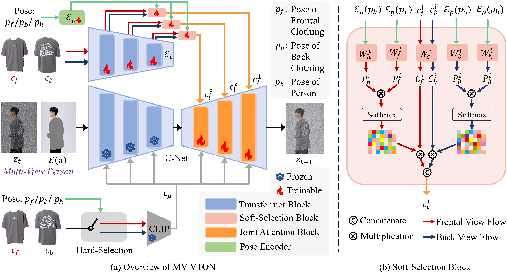

# MV-VTON

PyTorch implementation of **MV-VTON: Multi-View Virtual Try-On with Diffusion Models**

[](https://arxiv.org/abs/2404.17364)
[](https://hywang2002.github.io/MV-VTON/)


## Overview


> **Abstract:**  
> The goal of image-based virtual try-on is to generate an image of the target person naturally wearing the given
> clothing. However, most existing methods solely focus on the frontal try-on using the frontal clothing. When the views
> of the clothing and person are significantly inconsistent, particularly when the person’s view is non-frontal, the
> results are unsatisfactory. To address this challenge, we introduce Multi-View Virtual Try-ON (MV-VTON), which aims to
> reconstruct the dressing results of a person from multiple views using the given clothes. On the one hand, given that
> single-view clothes provide insufficient information for MV-VTON, we instead employ two images, i.e., the frontal and
> back views of the clothing, to encompass the complete view as much as possible. On the other hand, the diffusion
> models
> that have demonstrated superior abilities are adopted to perform our MV-VTON. In particular, we propose a
> view-adaptive
> selection method where hard-selection and soft-selection are applied to the global and local clothing feature
> extraction, respectively. This ensures that the clothing features are roughly fit to the person’s view. Subsequently,
> we
> suggest a joint attention block to align and fuse clothing features with person features. Additionally, we collect a
> MV-VTON dataset, i.e., Multi-View Garment (MVG), in which each person has multiple photos with diverse views and
> poses.
> Experiments show that the proposed method not only achieves state-of-the-art results on MV-VTON task using our MVG
> dataset, but also has superiority on frontal-view virtual try-on task using VITON-HD and DressCode datasets.

## Getting Started

### Installation

1. Clone the repository

```shell
git clone https://github.com/hywang2002/MV-VTON.git
cd MV-VTON
```

2. Install Python dependencies

```shell
conda env create -f environment.yaml
conda activate mv-vton
```

3. Download the pretrained [vgg](https://drive.google.com/file/d/1rvow8jStPt8t2prDcSRlnf8yzXhrYeGo/view?usp=sharing)
   checkpoint and put it in `models/vgg/` for Multi-View VTON and `Frontal-View VTON/models/vgg/` for Frontal-View VTON.
4. Download the pretrained [models](https://github.com/shadow2496/VITON-HD) and put `mvg.ckpt` in `checkpoint/` and
   put `vitonhd.ckpt`
   in `Frontal-View VTON/checkpoint/`.

### Datasets

#### MVG

1. Fill in  [Dataset Request Form](https://github.com/shadow2496/VITON-HD) to get MVG dataset.
2. Put the pre-warped under MVG dataset.

After these, the folder structure should look like this (the warp_feat_unpair* only included in test directory):

```
├── MVG
|   ├── unpaired.txt
│   ├── [train | test]
|   |   ├── image-wo-bg
│   │   ├── cloth
│   │   ├── cloth-mask
│   │   ├── warp_feat
│   │   ├── warp_feat_unpair
│   │   ├── ...
```

#### VITON-HD

1. Download [VITON-HD](https://github.com/shadow2496/VITON-HD) dataset
2. Download pre-warped cloth image/mask [Baidu Cloud](https://pan.baidu.com/s/1ss8e_Fp3ZHd6Cn2JjIy-YQ?pwd=x2k9) and put
   it under VITON-HD dataset.

After these, the folder structure should look like this (the unpaired-cloth* only included in test directory):

```
├── VITON-HD
|   ├── test_pairs.txt
|   ├── train_pairs.txt
│   ├── [train | test]
|   |   ├── image
│   │   │   ├── [000006_00.jpg | 000008_00.jpg | ...]
│   │   ├── cloth
│   │   │   ├── [000006_00.jpg | 000008_00.jpg | ...]
│   │   ├── cloth-mask
│   │   │   ├── [000006_00.jpg | 000008_00.jpg | ...]
│   │   ├── cloth-warp
│   │   │   ├── [000006_00.jpg | 000008_00.jpg | ...]
│   │   ├── cloth-warp-mask
│   │   │   ├── [000006_00.jpg | 000008_00.jpg | ...]
│   │   ├── unpaired-cloth-warp
│   │   │   ├── [000006_00.jpg | 000008_00.jpg | ...]
│   │   ├── unpaired-cloth-warp-mask
│   │   │   ├── [000006_00.jpg | 000008_00.jpg | ...]
```

### Inference

#### MVG

To test on paired settings (using `cp_dataset_mv_paired.py`), you can modify the `configs/viton512.yaml` and `main.py`,
or directly rename `cp_dataset_mv_paired.py` to `cp_dataset.py` (recommended). Then run:
```shell
sh test.sh
```

To test on unpaired settings, rename `cp_dataset_mv_unpaired.py` to `cp_dataset.py`, and do the same operation.

#### VITON-HD

or just simply run:

```shell
sh test.sh
```

### Training

#### MVG
We use Paint-by-Example as initialization, please download the pretrained model
from [Google Drive](https://drive.google.com/file/d/15QzaTWsvZonJcXsNv-ilMRCYaQLhzR_i/view) and save the model to
directory `checkpoints`. Rename `cp_dataset_mv_paired.py` to `cp_dataset.py`, then run:
```shell
sh train.sh
```

#### VITON-HD


## Acknowledgements

Our code is heavily borrowed from [Paint-by-Example](https://github.com/Fantasy-Studio/Paint-by-Example). We also
thank [PF-AFN](https://github.com/geyuying/PF-AFN), our warping module depends on it.

## Citation

```
@inproceedings{gou2023taming,
  title={Taming the Power of Diffusion Models for High-Quality Virtual Try-On with Appearance Flow},
  author={Gou, Junhong and Sun, Siyu and Zhang, Jianfu and Si, Jianlou and Qian, Chen and Zhang, Liqing},
  booktitle={Proceedings of the 31st ACM International Conference on Multimedia},
  year={2023}
}
```
